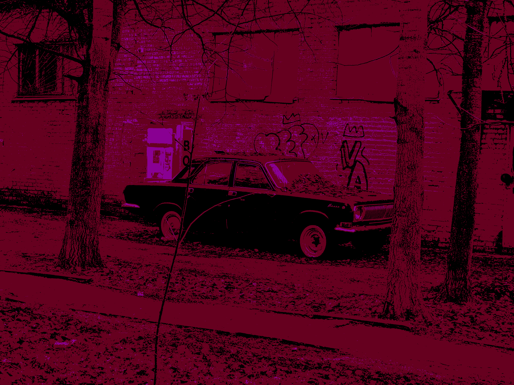
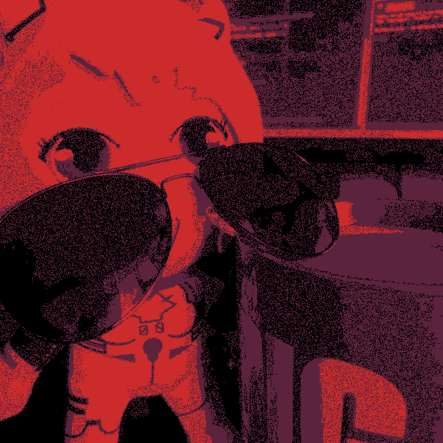

# 🥛 Milk Filter v1

  
   
  
<b>Программа для наложения атмосферных фильтров на фото и видео в стиле визуальных новелл  <i>"Milk inside a bag of milk"</i> и <i>"Milk outside a bag of milk"</i>.</b>

  
  
  
  

---

## 🌟 Описание

**Milk Filter** превращает любые ваши медиафайлы в мрачные, пиксельные и зашумленные шедевры, ограничивая цветовую палитру и добавляя характерный паттерн дизеринга. Программа имеет удобный графический интерфейс с темной темой, поддерживает работу как со статичными изображениями, так и с видеофайлами.

  
  
  
  
  
  

---

## ✨ Возможности

* **📷 Поддержка Фото и Видео**: Обработка `.png`, `.jpg`, `.jpeg`, `.bmp`, а также покадровая обработка видео `.mp4`, `.avi`.
* **🎨 Две цветовые палитры**: Классическая "Фиолетовая" (Milk mode) и альтернативная "Красная".
* **🗜️ Функция сжатия**: Встроенный ползунок для добавления артефактов JPEG-сжатия перед наложением фильтра.
* **👁️ Режим "Вырвиглаз"**: Настраиваемая плотность шума для создания эффекта жесткого визуального дискомфорта.
* **🌙 Кастомный UI**: Приятный темный интерфейс.

---

## ⚙️ Установка и запуск

Для запуска достаточно скачать файл **Moloko1.0.exe** и запустить

**Использование:**
1. Нажмите кнопку **Выбор Медиа** и выбираете фото/видео
2. Крутите **Настройки**
3. Жмёте **+ Create**
4. Нажимаете **Сохранить результат**
5. Наслаждаетесь

---

## Обратная связь

* Наш [Telegram канал](https://t.me/eratusiaTT)
* Наш [TikTok](https://www.tiktok.com/@eratusia)
* Скинуть разработчика на пакет мØлØка [ТЫК](https://www.donationalerts.com/r/eratusia)
